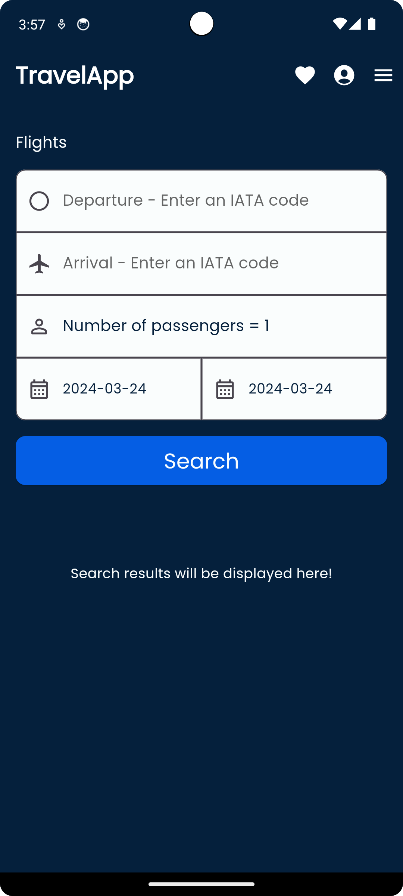

# Montcho Travel App
&nbsp;&nbsp;&nbsp;&nbsp; [](https://codecov.io/gh/mzdm/virtual_traveller_flutter)

The aim of this project is to build a new electronic flight platform in terms of technology and design. As a flutter developer, this project will allow me to learn new skills (UI/UX designer), to extend my knowledge in Dart/Flutter. Specifically in this project, I learnt how to do Test Drive Development (TDD), which gives you a better understanding of the concepts by writing the test cases before the production code.   

## Index
1. [Previews](#Previews)
2. [How to run](#How-to-run)
3. [App Architecture](#App-Architecture)
4. [State management](#State-management)
5. [TODO list](#TODO-list)
6. [dependencies](#Dependencies)
7. [UI inspiration](#UI-inspiration)
8. [Releated recomended resources](#Releated-recomended-resources)
9. [Credits](#Credits)
10. [Contribution](#Contribution)

## Previews
<p align="left">



</p>

## How to run
1. Clone this repository
2. Fetch packages:</br>
```flutter pub get```
3. 	- Run freezed and json_serializable code generators:</br>
```flutter pub run build_runner build --delete-conflicting-outputs```</br>
	- Automatically rebuild on changes with:</br>
```flutter pub run build_runner watch```
4. 	- Run on the device:</br>
```flutter run``` (run in Profile mode if you want to test the performance)</br>
	- Run on the web (make sure you are on the **beta** channel):</br>
```flutter run -d web```</br>
	- Run with flag on the web with better performance (experimental):</br>
```flutter run -d web --release --dart-define=FLUTTER_WEB_USE_SKIA=true```</br>
	- Run on the desktop (Windows) (make sure you are on the **dev** channel):</br>
```flutter run -d windows```</br></br>

**NOTE:** If you want to use remote APIs instead of local fake data, you need to obtain API key(s).
The web preview version uses fake data because it is built from the repository and API keys would get exposed.</br>
[Obtain the Amadeus Travel API key here](https://developers.amadeus.com/get-started/get-started-with-self-service-apis-335).

Then:
- place the key to this file: *lib/data/data_providers/remote/secrets.dart*
- set **quotaSaveMode** to ```false``` in *lib/utils/debug_options.dart*

## TODO list
1. **Flutter Project Structure**: The Secret to Maintainable Apps [Reso coder Proposal](https://resocoder.com/2019/08/27/flutter-tdd-clean-architecture-course-1-explanation-project-structure/)
2. **How to define Entities**: What kind of data will the Travel App operate with? Why and how do you merge an Entity and a model in Flutter?
3. **Define the first use-case and test it** get available flights as use-case and using Mockito to make the test Drive development 
3. **REST-APIs**: How to fetch flight offers from Amadeus API using OAuth2?[Amadeuis authorization](https://developers.amadeus.com/self-service/apis-docs/guides/authorization-262)
4. **Dependency Inversion**: How do you separate the domain layer (Abstract Repositories) and the Data layer (Repository involves)?
5. **Network info**: What is the benefit of managing network information separately from the repository?
6. **Local data source**: How can I display the last cached FlightOffers data when offline?
7. **Remote Data source**: How to call the API data using oauth2 ?

## Credits
1. [Which Flutter Project Structure for your project by Code With ANDREA](https://codewithandrea.com/articles/flutter-project-structure/)
2. [Flutter App Architecture with Riverpod: An Introduction](https://codewithandrea.com/articles/flutter-app-architecture-riverpod-introduction/)

# Contributing to TravelApp
he app is still in the development process and isn't suitable for contributions yet.

~~If you wish to contribute, file an issue with an appropriate tag or propose a PR. If it is a breaking change, please create an issue first.~~
